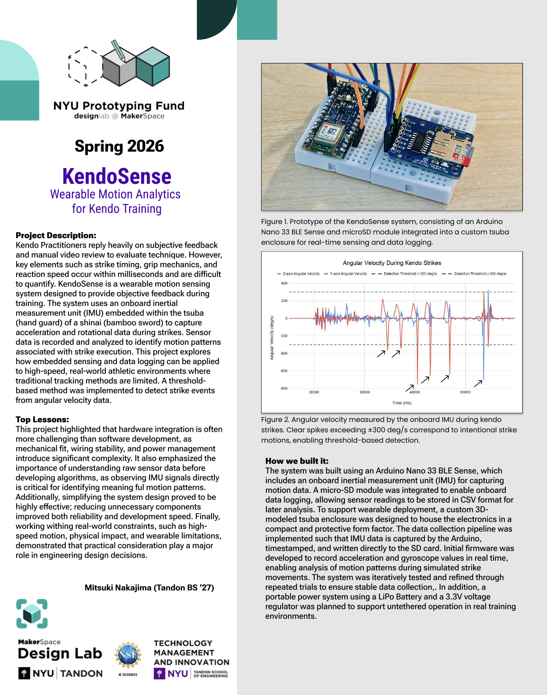

# KendoSense

Wearable Motion Analytics for Kendo Training

KendoSense is a wearable sensing system designed to explore how embedded sensors and motion analysis can provide objective feedback during kendo training. Traditional kendo instruction often relies on subjective observation and video review, making it difficult to precisely evaluate fast movements such as strike timing, grip mechanics (tenouchi), and reaction speed. This project investigates whether these aspects of technique can be quantified using inertial sensing and real-time data logging.

The system uses an onboard IMU (Inertial Measurement Unit) integrated into the tsuba (hand guard) of a shinai to capture acceleration and angular velocity during strikes. Motion data is recorded to a microSD card and later analyzed to identify patterns associated with strike execution. Initial experiments focused on threshold-based strike detection using gyroscope data and analyzing angular velocity spikes generated during swings.

## Features

- IMU-based motion sensing using Arduino Nano 33 BLE Sense
- Real-time acceleration and gyroscope data collection
- Onboard CSV data logging with microSD storage
- Threshold-based strike event detection
- Wearable hardware integration into a custom tsuba enclosure
- Planned synchronization with computer vision-based motion tracking

## Hardware

- Arduino Nano 33 BLE Sense
- microSD module
- LiPo battery (planned portable deployment)
- Custom 3D-printed tsuba enclosure

## Tech Stack

- Arduino / Embedded C++
- Python
- IMU Sensor Processing
- BLE Communication
- CSV Data Logging
- Fusion 360 / 3D Modeling

## Project Goals

- Analyze strike acceleration and rotational movement
- Investigate measurable indicators of tenouchi and fumikomi timing
- Explore wearable sensing in high-speed sports environments
- Build a lightweight and deployable training analysis system

## Lessons Learned

This project emphasized that hardware integration can often be more difficult than software implementation. Mechanical fit, wiring reliability, power stability, and wearable constraints introduced significant engineering challenges throughout development. It also highlighted the importance of understanding raw sensor signals before attempting higher-level analysis or machine learning approaches. Iterative prototyping and simplifying the overall system design significantly improved reliability and development speed.

## Status

Active project — currently expanding toward synchronized motion analysis using additional sensing and computer vision techniques.

## Poster

